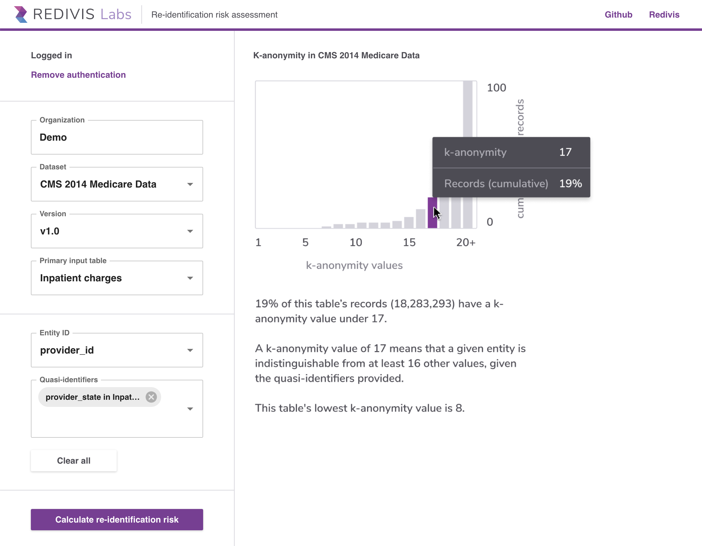

# Redivis k-anonymity calculator

This repository is the source code for the k-anonymity application available at [labs.redivis.com/k-anonymity](https://labs.redivis.com/k-anonymity).

## About the tool

This tool aims to compute the re-identification risks of datasets that are stored on the Redivis platform. To do so, it computes the distribution of [k-anonymity](https://en.wikipedia.org/wiki/K-anonymity) scores for a given dataset (a dataset is k-anonymous for each individual within the dataset if they cannot be distinguished from at least `k - 1` individuals who also appear in the dataset). You can use this tool to perform a k-anonymity analysis on any dataset that you have access to in Redivis.

In order to compute k-anonymity for a dataset, we must first identify any "quasi-identifiers" within the dataset that could be used to re-identify individuals (e.g., date of birth, name, zip code, etc). This application will automatically select quasi-identifier variables based on an analysis of their metadata, though this approach is limited — you should make sure to add and/or remove any quasi-identifiers from the list based on your domain expertise and understanding of the dataset. Any variable that could be used to subsequently re-identify an individual, even in part, should be selected as a quasi-identifier.

If your dataset contains multiple tables, you will also be asked to select the "Entity ID" variable that can be used to join individuals across tables. For example, if we have a de-identified medical claims dataset that contains one table for patient demographics, and another for hospital admissions, we'll want to link these tables by any patient identifier and establish re-identification risk based on quasi-identifiers from both tables.

Once you have completed all the input fields, click the "Calculate re-identification risk" button. This will execute a query against the data — once completed, a histogram will be generated that shows the cumulative percent of records that are under a given k-anonymity threshold. For example, if 20% of the records have a k-anonymity value less than or equal to 9, this means that individuals in 20% of the records are distinct from (at most) 8 other individuals.

## About this repository

This is a client-side application developed in React.js, utilizing the Redivis API for authorization, listing datasets and their metadata, as well as for executing the k-anonymity query. The specific SQL query used to compute k-anonymity can be found in `src/helpers/computeRisk.js` — this utilizes the BigQuery SQL dialect, which is ANSI-SQL compliant and generally portable to other database systems.

## Acknowledgements

This application was developed in collaboration with the [Stanford Center for Population Health Sciences](https://med.stanford.edu/phs.html), with funding support through the [Alfred P. Sloan Foundation](https://sloan.org/). We are incredibly grateful to all involved for their help and support.

## DISCLAIMER
This tool was designed for exploratory and experimental purposes ONLY, and there is no guarantee that a dataset is appropriately anonymized even if it contains a high k-anonymity score. K-anonymity has well documented limitations as a risk analysis tool, and the scores computed by this tool are based on the specifically selected quasi-identifiers, which may not include all identifier variables in the dataset. As a best practice, data derived from PII / PHI should always be treated with the same caution as if it were the original, identifiable data.

## License
This software is distributed under the MIT license. You may use and modify the code for any purpose, as long as the original license is preserved.
